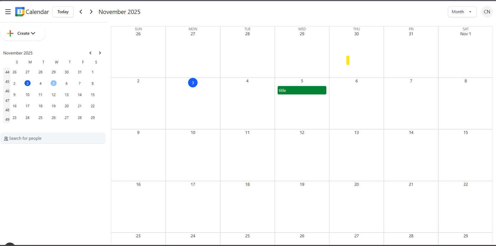
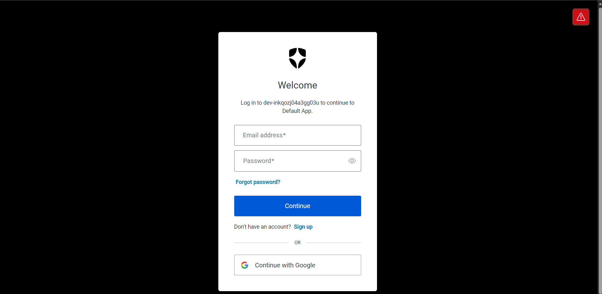
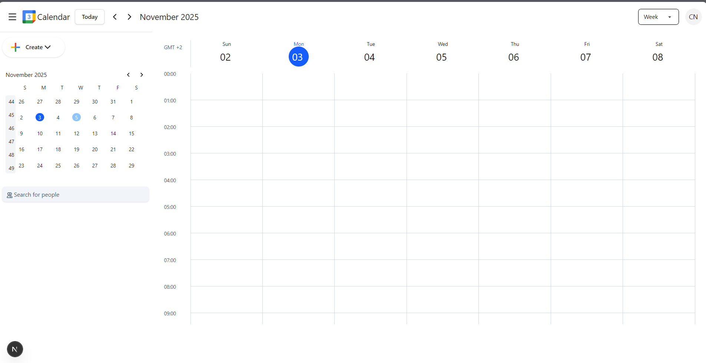

# 📅 Modern Calendar App

> A sleek, full-stack calendar application built with **Next.js**, **Auth0**, and **Prisma** — designed for intuitive event management and a Google Calendar–inspired experience.



---

## 🌟 Overview

**Modern Calendar App** is a responsive, full-stack web application for managing events, meetings, and schedules.  
It offers a secure authentication system, real-time event CRUD operations, and a clean, user-friendly interface.

---

## 🚀 Features

### 🔐 Authentication
- Secure login with **Auth0**
- Supports **Google**, **GitHub**, and **LinkedIn** social logins  
- Session management and **protected routes**
- **Single Sign-On (SSO)** ready



---

### 🗓️ Event Management
- Create, update, and delete events with full **CRUD** support  
- Add details like title, description, date, time, and event type  
- **Real-time updates** for a seamless experience  
- Delete confirmation & optimized database interactions



---

### 🎨 UI / UX
- **Google Calendar–inspired design**
- Built with **Tailwind CSS**, **Radix UI**, and **Shadcn/ui**
- Fully **responsive** and mobile-friendly  
- Smooth animations and transitions with **Framer Motion**

---

## 🧩 Tech Stack

| Layer | Technologies |
|-------|---------------|
| **Frontend** | Next.js 14, React, TypeScript, Tailwind CSS |
| **Backend** | Next.js API Routes, Prisma ORM |
| **Database** | PostgreSQL |
| **Authentication** | Auth0, NextAuth.js |
| **UI Components** | Radix UI, Shadcn/ui |
| **Date Handling** | Day.js |
| **Icons** | React Icons, Lucide Icons |
| **Deployment** | Vercel |

---

## ⚙️ Installation

```bash
# Clone the repo
git clone https://github.com/your-username/calendar-app.git
cd calendar-app

# Install dependencies
npm install

# Set up environment variables
cp .env.example .env.local

# Run development server
npm run dev
